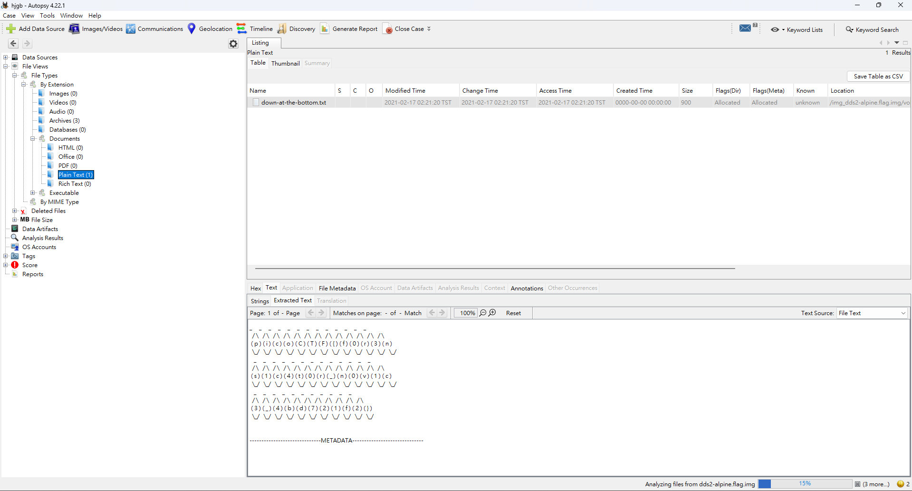

# Disk, disk, sleuth! II

## 題目描述 (Description)

All we know is the file with the flag is named `down-at-the-bottom.txt`...
[dds2-alpine.flag.img.gz](https://challenge-files.picoctf.net/c_wily_courier/faf30bf494c9feae75263f7006b2042ecbbdd211e5d096ffcfff72b123396a19/dds2-alpine.flag.img.gz)

### 提示 (Hints)

1. Hint 1
   The sleuthkit has some great tools for this challenge as well.
2. Hint 2
   Sleuthkit docs here are so helpful: TSK Tool Overview
3. Hint 3
   This disk can also be booted with qemu!

## 解題思路 (Solution Walkthrough)

1.  **第一步**：下載下來得到映像檔，於是使用 Autopsy 分析後成功取得 flag
   

   ```
     / \   / \   / \   / \   / \   / \   / \   / \   / \   / \   / \   / \   / \ 
   ( p ) ( i ) ( c ) ( o ) ( C ) ( T ) ( F ) ( { ) ( f ) ( 0 ) ( r ) ( 3 ) ( n )
   \_/   \_/   \_/   \_/   \_/   \_/   \_/   \_/   \_/   \_/   \_/   \_/   \_/ 
      _     _     _     _     _     _     _     _     _     _     _     _     _  
   / \   / \   / \   / \   / \   / \   / \   / \   / \   / \   / \   / \   / \ 
   ( s ) ( 1 ) ( c ) ( 4 ) ( t ) ( 0 ) ( r ) ( _ ) ( n ) ( 0 ) ( v ) ( 1 ) ( c )
   \_/   \_/   \_/   \_/   \_/   \_/   \_/   \_/   \_/   \_/   \_/   \_/   \_/ 
      _     _     _     _     _     _     _     _     _     _     _  
   / \   / \   / \   / \   / \   / \   / \   / \   / \   / \   / \ 
   ( 3 ) ( _ ) ( 4 ) ( b ) ( d ) ( 7 ) ( 2 ) ( 1 ) ( f ) ( 2 ) ( } )
   \_/   \_/   \_/   \_/   \_/   \_/   \_/   \_/   \_/   \_/   \_/ 
   ```

## Flag

```text
picoCTF{f0r3ns1c4t0r_n0v1c3_4bd721f2}
```