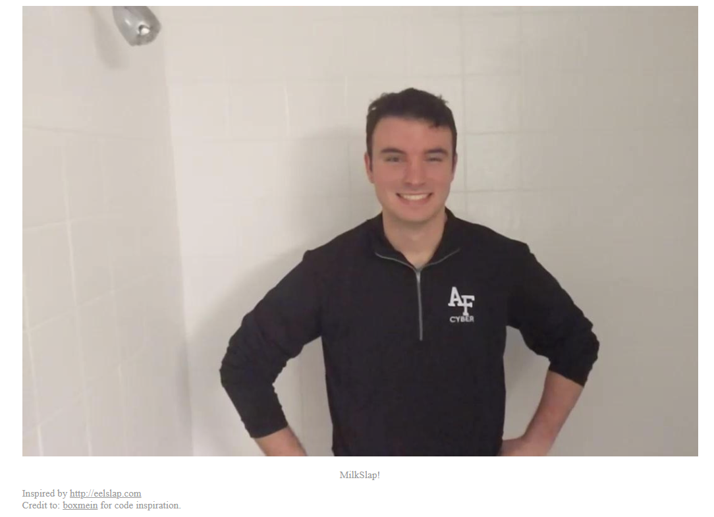

# Milkslap

## 題目描述 (Description)

🥛
Additional details will be available after launching your challenge instance.

### 提示 (Hints)

1. Hint 1
   Look at the problem category

## 解題思路 (Solution Walkthrough)

1.  **第一步**：進去網站裡面，只有一張圖片，並沒有其他資訊
   

2.  **第二步**：之後查看 `concat_v.png` 的 metadata 皆沒有發現異常，於是嘗試使用 `zsteg` 來試試，沒想到卻看到下面這串錯誤
   ```
   ┌──(kali㉿kali)-[~/Desktop]
   └─$ zsteg -a concat_v.png      
   /home/kali/.local/share/gem/ruby/3.3.0/gems/zpng-0.4.6/lib/zpng/scan_line.rb:369:in `prev_scanline_byte': stack level too deep (SystemStackError)
         from /home/kali/.local/share/gem/ruby/3.3.0/gems/zpng-0.4.6/lib/zpng/scan_line.rb:319:in `block in decoded_bytes'
         from /home/kali/.local/share/gem/ruby/3.3.0/gems/zpng-0.4.6/lib/zpng/scan_line.rb:318:in `upto'
         from /home/kali/.local/share/gem/ruby/3.3.0/gems/zpng-0.4.6/lib/zpng/scan_line.rb:318:in `decoded_bytes'
         from /home/kali/.local/share/gem/ruby/3.3.0/gems/zpng-0.4.6/lib/zpng/scan_line/mixins.rb:17:in `prev_scanline_byte'
         from /home/kali/.local/share/gem/ruby/3.3.0/gems/zpng-0.4.6/lib/zpng/scan_line.rb:377:in `prev_scanline_byte'
         from /home/kali/.local/share/gem/ruby/3.3.0/gems/zpng-0.4.6/lib/zpng/scan_line.rb:319:in `block in decoded_bytes'
         from /home/kali/.local/share/gem/ruby/3.3.0/gems/zpng-0.4.6/lib/zpng/scan_line.rb:318:in `upto'
         from /home/kali/.local/share/gem/ruby/3.3.0/gems/zpng-0.4.6/lib/zpng/scan_line.rb:318:in `decoded_bytes'
            ... 10225 levels...
         from /home/kali/.local/share/gem/ruby/3.3.0/gems/zsteg-0.2.14/lib/zsteg.rb:26:in `run'
         from /home/kali/.local/share/gem/ruby/3.3.0/gems/zsteg-0.2.14/bin/zsteg:8:in `<top (required)>'
         from /usr/local/bin/zsteg:25:in `load'
         from /usr/local/bin/zsteg:25:in `<main>'
   ```

3.  **第三步**：[上網查](https://github.com/zed-0xff/zsteg/issues/30)了以後發現把 `RUBY_THREAD_VM_STACK_SIZE` 調高即可解決
   ```
   ┌──(kali㉿kali)-[~/Desktop]
   └─$ RUBY_THREAD_VM_STACK_SIZE=500000000 zsteg concat_v.png
   imagedata           .. text: "\n\n\n\n\n\n\t\t"
   chunk:0:IHDR        .. file: Adobe Photoshop Color swatch, version 0, 1280 colors; 1st RGB space (0), w 0xb9a0, x 0x802, y 0, z 0; 2nd HSB space (1), w 0, x 0, y 0, z 0
   b1,b,lsb,xy         .. text: "picoCTF{imag3_m4n1pul4t10n_sl4p5}\n"
   b1,bgr,lsb,xy       .. <wbStego size=0x941a5b ext=nil data="\xB6\xAD\xB6}\xDB\xB2lR\x7F\xDF\x86\xB7c\xFC\xFF\xBF\x02Zr\x8E\xE2Z\x12\xD8q\xE5&MJ-X:\xB5\xBF\xF7\x7F\xDB\xDFI\bm\xDB\xDB\x80m\x00\x00\x00\xB6m\xDB\xDB\xB6\x00\x00\x00\xB6\xB6\x00m\xDB\x12\x12m\xDB\xDB\x00\x00\x00\x00\x00\xB6m\xDB\x00\xB6\x00\x00\x00\xDB\xB6mm\xDB\xB6\xB6\x00\x00\x00\x00\x00m\xDB" even=true hdr=nil enc=nil mix=true controlbyte="[">
   b2,r,lsb,xy         .. text: ["U" repeated 8 times]
   b2,r,msb,xy         .. file: VISX image file
   b2,g,lsb,xy         .. file: VISX image file
   b2,g,msb,xy         .. file: SoftQuad DESC or font file binary - version 15722
   b2,b,msb,xy         .. text: "UfUUUU@UUU"
   b4,r,lsb,xy         .. text: "\"\"\"\"\"#4D"
   b4,r,msb,xy         .. text: "wwww3333"
   b4,g,lsb,xy         .. text: "wewwwwvUS"
   b4,g,msb,xy         .. text: "\"\"\"\"DDDD"
   b4,b,lsb,xy         .. text: "vdUeVwweDFw"
   b4,b,msb,xy         .. text: "UUYYUUUUUUUU"
   ```

## Flag

```text
picoCTF{imag3_m4n1pul4t10n_sl4p5}
```