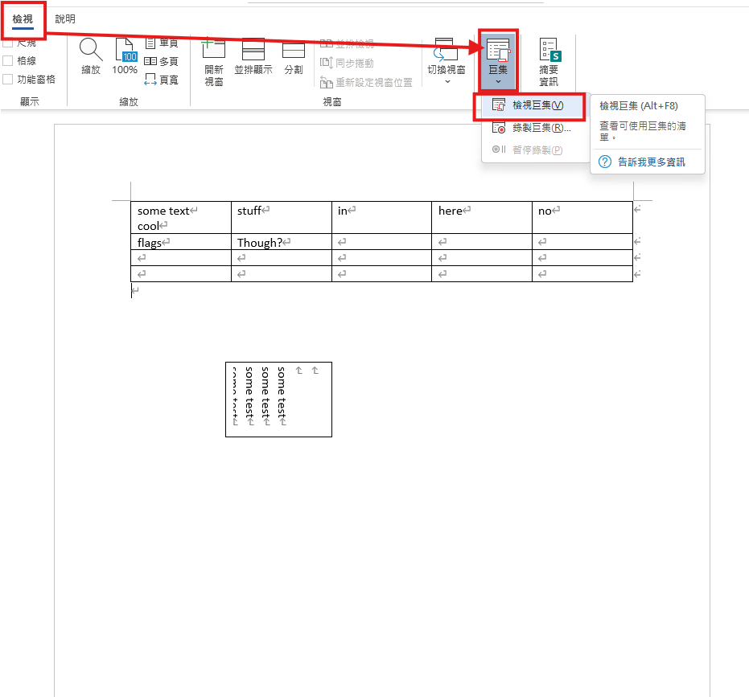
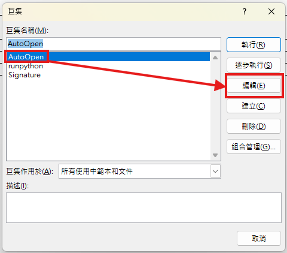
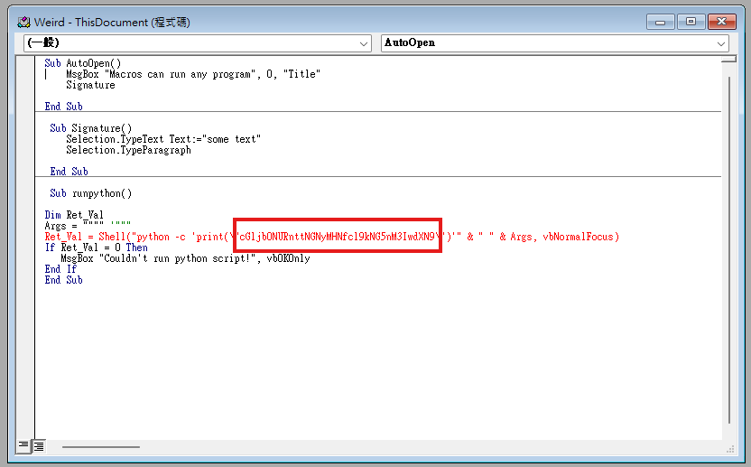

# Weird File

## 題目描述 (Description)

What could go wrong if we let Word documents run programs? (aka "in-the-clear").
[weird.docm](https://challenge-files.picoctf.net/c_wily_courier/b5eb3574e45fb177ab55cdfa3cf81c79bfc87319bb87bec1cffe5fdd17b8fca9/weird.docm)

### 提示 (Hints)

1. Hint 1  
    https://www.youtube.com/watch?v=Y7IJjnLGqTQ

## 解題思路 (Solution Walkthrough)

1. **第一步**：用 word 開啟 `weird.docm`，並按圖中步驟檢視巨集
    

2. **第二步**：點編輯巨集
    

3. **第三步**：打開後即可看到一串 base64 編碼的字串，那個即為 flag
    

## Flag

```text
picoCTF{m4cr0s_r_d4ng3r0us}
```
