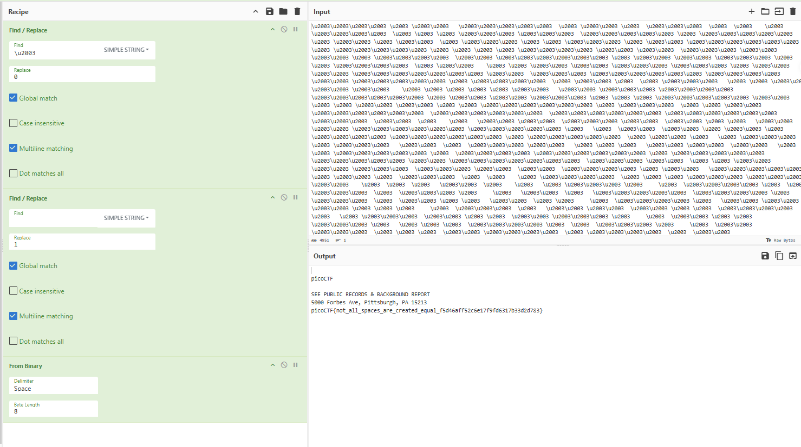

# WhitePages

## 題目描述 (Description)

I stopped using YellowPages and moved onto WhitePages... but [the page they gave me](https://challenge-files.picoctf.net/c_fickle_tempest/4de4b105d28cb6df34d9805217f2460b978a37dafc3dfc50edadd8d424dd311a/whitepages.txt) is all blank!

### 提示 (Hints)

1. Hint 1  
    There is data encoded somewhere... there might be an online decoder.

## 解題思路 (Solution Walkthrough)

1. **第一步**：把 whitepages.txt 裡面的東西轉成 unicode 以後，可以發現裡面其實有些東西是 `\u2003`

    ```text
    \u2003\u2003\u2003\u2003 \u2003 \u2003\u2003   \u2003\u2003\u2003\u2003\u2003  \u2003 \u2003\u2003 \u2003  \u2003\u2003\u2003  \u2003  \u2003    \u2003 \u2003\u2003\u2003\u2003  \u2003 \u2003 \u2003 \u2003\u2003\u2003 \u2003\u2003\u2003  \u2003\u2003\u2003\u2003\u2003 \u2003 \u2003\u2003\u2003\u2003\u2003 \u2003 \u2003\u2003 \u2003 \u2003\u2003  \u2003 \u2003\u2003\u2003 \u2003 \u2003 \u2003\u2003\u2003 \u2003 \u2003\u2003 \u2003\u2003\u2003\u2003\u2003\u2003 \u2003 \u2003\u2003\u2003\u2003\u2003 \u2003 \u2003 \u2003 \u2003 \u2003\u2003\u2003\u2003 \u2003\u2003 \u2003\u2003  \u2003\u2003\u2003 \u2003\u2003 \u2003\u2003 \u2003 \u2003\u2003\u2003\u2003  \u2003\u2003 \u2003\u2003\u2003\u2003\u2003\u2003 \u2003 \u2003\u2003 \u2003\u2003 \u2003\u2003\u2003 \u2003 \u2003 \u2003\u2003\u2003\u2003  \u2003 \u2003\u2003    \u2003 \u2003 \u2003\u2003 \u2003\u2003 \u2003\u2003\u2003 \u2003\u2003\u2003 \u2003 \u2003\u2003  \u2003\u2003 \u2003\u2003\u2003\u2003\u2003\u2003\u2003 \u2003\u2003  \u2003\u2003\u2003 \u2003\u2003\u2003\u2003\u2003\u2003 \u2003\u2003\u2003\u2003 \u2003\u2003 \u2003\u2003\u2003\u2003\u2003 \u2003 \u2003\u2003\u2003\u2003  \u2003 \u2003\u2003 \u2003  \u2003 \u2003\u2003\u2003   \u2003 \u2003 \u2003\u2003 \u2003\u2003 \u2003\u2003    \u2003 \u2003 \u2003 \u2003 \u2003 \u2003\u2003   \u2003\u2003 \u2003\u2003\u2003 \u2003\u2003\u2003\u2003 \u2003\u2003\u2003\u2003\u2003\u2003 \u2003 \u2003\u2003 \u2003\u2003 \u2003\u2003\u2003 \u2003 \u2003 \u2003 \u2003\u2003\u2003\u2003\u2003 \u2003\u2003    \u2003 \u2003 \u2003\u2003 \u2003\u2003 \u2003 \u2003 \u2003\u2003\u2003\u2003\u2003\u2003 \u2003 \u2003\u2003\u2003  \u2003 \u2003 \u2003\u2003  \u2003\u2003\u2003\u2003\u2003\u2003  \u2003\u2003\u2003\u2003\u2003\u2003  \u2003\u2003\u2003\u2003\u2003\u2003 \u2003\u2003\u2003\u2003\u2003\u2003 \u2003\u2003\u2003  \u2003\u2003  \u2003    \u2003   \u2003\u2003 \u2003\u2003  \u2003\u2003\u2003 \u2003\u2003  \u2003\u2003 \u2003 \u2003   \u2003\u2003  \u2003\u2003 \u2003\u2003\u2003\u2003\u2003\u2003 \u2003\u2003\u2003\u2003\u2003 \u2003   \u2003  \u2003\u2003  \u2003\u2003 \u2003 \u2003\u2003 \u2003  \u2003\u2003\u2003\u2003 \u2003\u2003\u2003\u2003\u2003\u2003 \u2003 \u2003\u2003\u2003\u2003\u2003  \u2003 \u2003\u2003 \u2003   \u2003 \u2003\u2003\u2003   \u2003 \u2003\u2003\u2003   \u2003\u2003  \u2003  \u2003\u2003\u2003 \u2003\u2003   \u2003 \u2003 \u2003   \u2003\u2003 \u2003\u2003  \u2003\u2003   \u2003  \u2003 \u2003\u2003\u2003\u2003\u2003 \u2003  \u2003\u2003\u2003\u2003 \u2003\u2003\u2003\u2003\u2003\u2003 \u2003 \u2003\u2003\u2003\u2003\u2003 \u2003\u2003\u2003\u2003\u2003 \u2003\u2003 \u2003\u2003\u2003\u2003\u2003\u2003\u2003  \u2003\u2003\u2003 \u2003\u2003  \u2003 \u2003 \u2003\u2003  \u2003\u2003 \u2003\u2003\u2003  \u2003\u2003\u2003 \u2003\u2003  \u2003\u2003  \u2003\u2003\u2003\u2003 \u2003 \u2003\u2003   \u2003\u2003\u2003\u2003\u2003  \u2003 \u2003\u2003 \u2003  \u2003\u2003\u2003  \u2003  \u2003    \u2003 \u2003\u2003\u2003\u2003  \u2003 \u2003 \u2003 \u2003\u2003\u2003 \u2003\u2003\u2003  \u2003\u2003    \u2003  \u2003  \u2003   \u2003\u2003  \u2003    \u2003   \u2003 \u2003\u2003\u2003 \u2003     \u2003  \u2003\u2003\u2003\u2003 \u2003  \u2003  \u2003\u2003\u2003  \u2003  \u2003\u2003\u2003 \u2003     \u2003   \u2003\u2003  \u2003   \u2003\u2003\u2003\u2003\u2003  \u2003\u2003\u2003\u2003 \u2003  \u2003\u2003\u2003  \u2003  \u2003\u2003 \u2003 \u2003   \u2003\u2003  \u2003 \u2003     \u2003  \u2003\u2003\u2003\u2003 \u2003   \u2003\u2003 \u2003\u2003  \u2003\u2003 \u2003 \u2003 \u2003     \u2003  \u2003\u2003\u2003  \u2003   \u2003\u2003 \u2003\u2003  \u2003\u2003 \u2003 \u2003  \u2003\u2003\u2003\u2003 \u2003   \u2003 \u2003\u2003\u2003  \u2003\u2003 \u2003 \u2003  \u2003\u2003 \u2003\u2003\u2003 \u2003     \u2003  \u2003\u2003 \u2003 \u2003   \u2003\u2003\u2003 \u2003   \u2003 \u2003 \u2003  \u2003\u2003\u2003\u2003 \u2003  \u2003  \u2003\u2003\u2003 \u2003     \u2003  \u2003\u2003  \u2003\u2003\u2003  \u2003 \u2003 \u2003  \u2003\u2003 \u2003\u2003\u2003\u2003  \u2003 \u2003\u2003\u2003\u2003  \u2003  \u2003\u2003  \u2003\u2003\u2003\u2003 \u2003  \u2003\u2003  \u2003\u2003  \u2003\u2003  \u2003\u2003\u2003  \u2003 \u2003 \u2003\u2003  \u2003\u2003 \u2003\u2003  \u2003\u2003\u2003  \u2003\u2003  \u2003  \u2003\u2003  \u2003\u2003 \u2003 \u2003\u2003  \u2003\u2003\u2003 \u2003\u2003  \u2003   \u2003  \u2003\u2003  \u2003\u2003\u2003   \u2003\u2003 \u2003  \u2003\u2003  \u2003\u2003  \u2003\u2003 \u2003\u2003\u2003\u2003  \u2003  \u2003\u2003\u2003  \u2003\u2003  \u2003\u2003  \u2003\u2003\u2003 \u2003\u2003  \u2003   \u2003  \u2003\u2003\u2003 \u2003\u2003\u2003  \u2003\u2003  \u2003\u2003  \u2003\u2003  \u2003  \u2003\u2003 \u2003\u2003\u2003\u2003  \u2003\u2003 \u2003\u2003  \u2003\u2003 \u2003\u2003\u2003\u2003  \u2003   \u2003\u2003   \u2003\u2003\u2003\u2003\u2003  \u2003\u2003  \u2003     \u2003 \u2003\u2003\u2003\u2003 \u2003 \u2003
    ```

2. **第二步**：用 cyberchef 的替換功能，把 0 換成 1，並且轉成文字即可得到 flag
    

## Flag

```text
picoCTF{not_all_spaces_are_created_equal_f5d46aff52c6e17f9fd6317b33d2d783}
```
