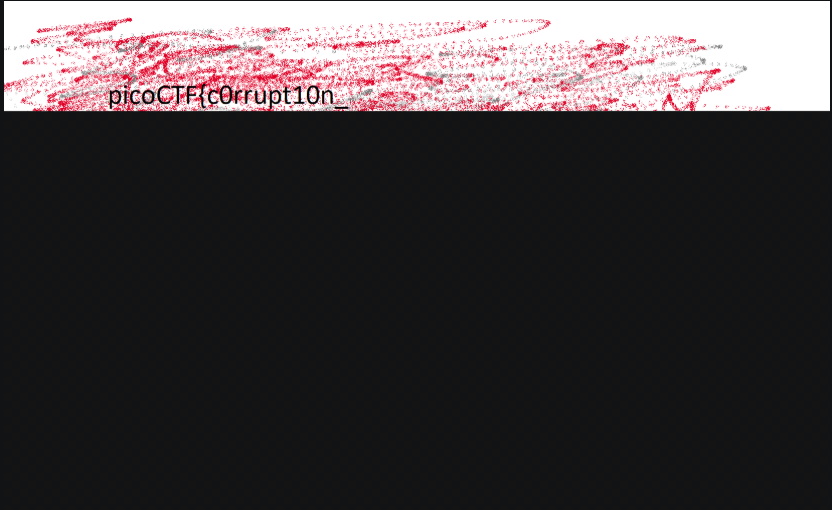

# c0rrupt

## 題目描述 (Description)

We found this [file](https://challenge-files.picoctf.net/c_fickle_tempest/87bdc8ce30b177d033b3d68bca4647950bb07304032861baa912ebe08701d355/mystery). Recover the flag.

### 提示 (Hints)

1. Hint 1  
    Try fixing the file header

## 解題思路 (Solution Walkthrough)

1. **第一步**：用 HxD 打開以後滑到最底下可以看到 `00 00 00 00 49 45 4E 44 AE 42 60 82`，基本上就確定這是一張 png 了

2. **第二步**：先看 File Signature，原本的是 `89 65 4E 34 0D 0A B0 AA`，和 `89 50 4E 47 0D 0A 1A 0A` 不一樣，所以就把他替換成新的

3. **第三步**：再看 `IHDR` 這個 Chunk，原本的是 `00 00 00 0D 43 22 44 52`，但後面那個應為 IHDR，於是把他改成 `00 00 00 0D 49 48 44 52`

4. **第四步**：能直接看出來的都修完了，但是還是沒辦查看圖片，於是我丟進去 `pngcheck -v mystery.png`，並發現以下錯誤，可以看到這張圖片的 X 軸大到不正常
    1. 以 hex 來看的話，原本的 X 軸為 `AA 00 16 25`，Y 軸為 `00 00 16 25`，計算出來理論上的 `CRC` 為 `38d82c82`
    2. 我們可以假設這張圖原本常寬一樣高，拿 X 軸為 `00 00 16 25`，Y 軸為 `00 00 16 25` 去算 `CRC`，會發現 `CRC` 恰好為 `495224f0`
    3. 於是我們這裡要修正的是把 X 軸改為 `00 00 16 25`

    ```text
    File: mystery.png (202940 bytes)
    chunk IHDR at offset 0x0000c, length 13
        1642 x 1095 image, 24-bit RGB, non-interlaced
    chunk sRGB at offset 0x00025, length 1
        rendering intent = perceptual
    chunk gAMA at offset 0x00032, length 4: 0.45455
    chunk pHYs at offset 0x00042, length 9: 2852132389x5669 pixels/meter
    CRC error in chunk pHYs (computed 38d82c82, expected 495224f0)
    ERRORS DETECTED in mystery.png
    ```

5. **第五步**：可以看到 `pHYs` 結束後有個可疑的東西 `AA AA FF A5 AB 44 45 54`，其中 `44 45 54` 轉換為 `ASCII` 字元以後為 `DET`，但是並沒有這種數據塊，於是就想說是不是可以把他改成 `pHYs` 之後一定要有得 `IDAT` 數據塊，於是呢把 `AB 44 45 54` 改為 `49 44 41 54`，之後即可看到圖片 (可能要用 Windows 內建的軟體開，我自己用 vscode 只看得到一點點而已，如附圖，不知道是什麼問題)
    

## Flag

```text
picoCTF{c0rrupt10n_1847995}
```

## 參考資料

1. https://ctf-wiki.org/zh-tw/misc/picture/png/
2. https://www.w3.org/TR/PNG-Chunks.html