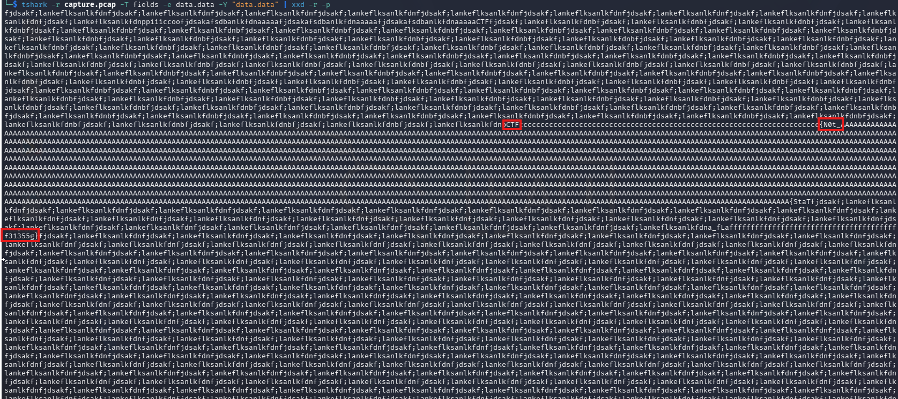
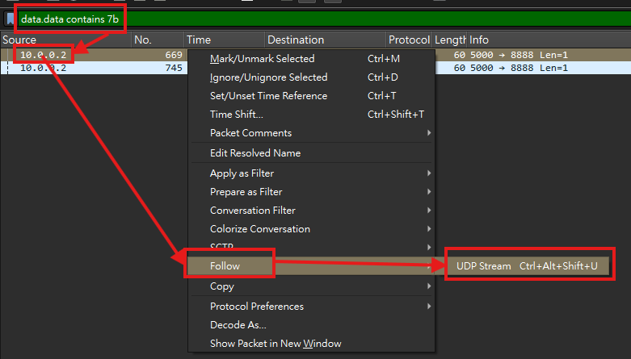

# Problem Name

## 題目描述 (Description)

We found this [packet capture](https://challenge-files.picoctf.net/c_fickle_tempest/134d2a2cf6ec5b7e757effc9b32977af7cc324b8e99a5ddb64737794a14dc18d/capture.pcap). Recover the flag.

### 提示 (Hints)

1. Hint 1  
    Try using a tool like Wireshark, What are streams?

## 解題思路 (Solution Walkthrough)

1. **第一步**：使用這串 `tshark -r capture.pcap -T fields -e data.data -Y "data.data" | xxd -r -p`，用來取得所有的 data，並先過濾掉空白的，好了以後再把 hex 轉為 utf-8

2. **第二步**：完了以後會看到很多其他的東西，但都是重複的
    

3. **第三步**：第二步整理不出什麼東西，於是改在 wireshark gui 上面搜尋 `data contains 7b` (data 包含 `{`)，會找到兩筆結果，`右鍵 -> follow -> UDP Stream`，其中一筆是 `picoCTF{N0t_a_fLag}`，另一筆則為正確 flag
    

## Flag

```text
picoCTF{StaT31355_636f6e6e}
```
