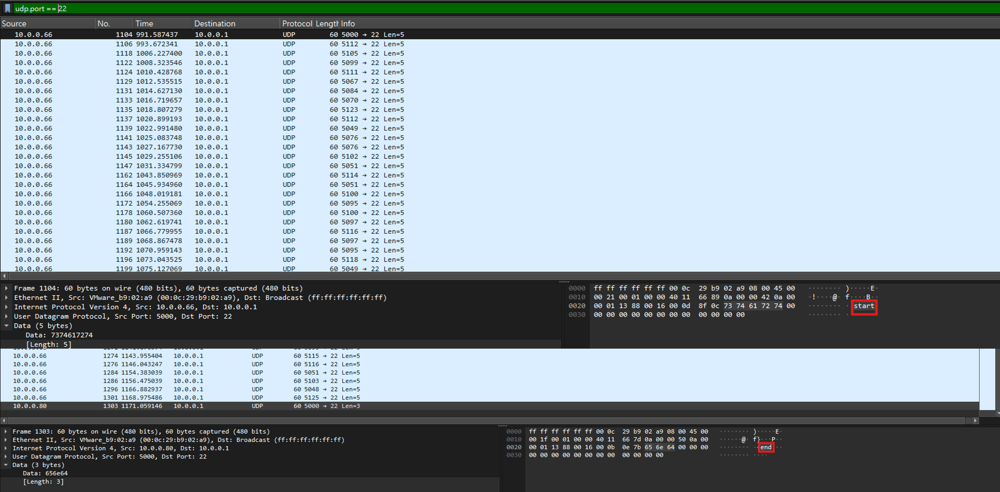

# shark on wire 2

## 題目描述 (Description)

We found this [packet capture](https://challenge-files.picoctf.net/c_fickle_tempest/edaf70675fae491d08043f5f626637436b05319785fa562e9274cdb4b09ec7ba/capture.pcap). Recover the flag.

### 提示 (Hints)

(None)

## 解題思路 (Solution Walkthrough)

1.  **第一步**：用 wireshark 打開 capture.pcap 以後，找了半天都沒看到什麼，於是之後在網路上找一些[線索](https://zomry1.github.io/shark-on-wire-2/)

2.  **第二步**：下圖中第一個封包有 start，最後一個封包則是 end，有點可疑
   

3.  **第三步**：分析後發現 flag 就在 port 裡面，例如第二個封包中的 `5112`， flag 的第一個字即為 112 => p

## Flag

```text
picoCTF{p1LLf3r3d_data_v1a_st3g0}
```