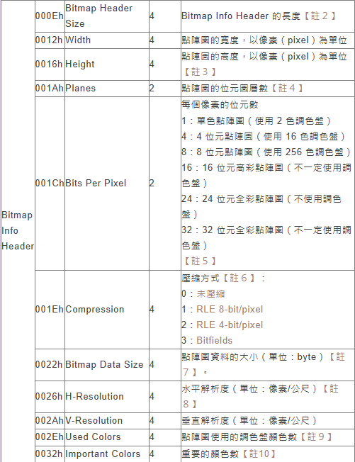
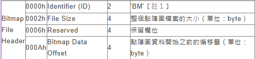

# tunn3l v1s10n

## 題目描述 (Description)

We found this file. Recover the flag.
[tunn3l_v1s10n](https://challenge-files.picoctf.net/c_wily_courier/626df9feed926c1e1280804f5d87fde5576e266ff250a819a5528b0471b0f3f7/tunn3l_v1s10n)

### 提示 (Hints)

1. Hint 1  
    Weird that it won't display right...

## 解題思路 (Solution Walkthrough)

1. **第一步**：先用 HxD 打開，發現他的 magic bytes 為 `42 4D`，也就代表他是一個 `bmp` 檔案

2. **第二步**：可以看到 file header 為 `42 4D 8E 26 2C 00 00 00 00 00 BA D0 00 00`，其中 `BA D0 00 00` 為起始位置，但這裡的起始位置怪怪的，應該要是 `36 00 00 00` (14bytes 的 header + 40bytes 的 DIB header)

3. **第三步**：可以看到 Bitmap Header Size 為 `BA D0 00 00`，Windows 通常為 `28 00 00 00`，改完後可以看到一張圖片，但上面並沒有 flag

4. **第四步**：我們知道 `28 00 00 00 6E 04 00 00 32 01 00 00 01 00 18 00` 前面四個 bytes 為 Bitmap Header Size，中間四個 bytes 為寬度，再來四個 bytes 是高度，之後兩個 bytes 是 planes (點陣圖的位元圖層數)，最後則是 Bits Per Pixel
    

5. **第五步**：這個 bmp 的檔案大小看 file header 可以知道為 `8E 26 2C 00` = `0x002c268e` = `2893454`，舊的寬 (`6E 04 00 00` = `0x046e` = `1134`) * 高 (`32 01 00 00` = `0x0132` = `306`) * Bits Per Pixel (`18 00` = `0x18` = `24`) / 8 = `1041012`，明顯小於檔案大小
    

6. **第六步**：我們先嘗試調大圖片的高，可以計算出來，新的高應為 `2893454 * 8 / 24 / 1134` = `850` = `0x352` = `52 03 00 00`

## Flag

```text
picoCTF{qu1t3_a_v13w_2020}
```

## 參考資料

1. https://crazycat1130.pixnet.net/blog/posts/1345538
2. https://zh.wikipedia.org/zh-tw/BMP
3. https://blog.lusw.dev/posts/bitmap-file-structure.html