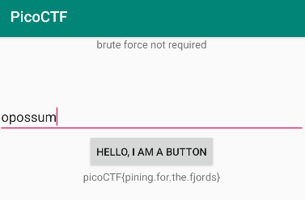

# droids1

## 題目描述 (Description)

Find the pass, get the flag. Check out this [file](https://challenge-files.picoctf.net/c_fickle_tempest/0c0fee0ca27866e0888594bd0a00165097c35f4f9d0654d69c7a3f3b0283e615/one.apk).

### 提示 (Hints)

1. Hint 1
   Try using apktool and an emulator
2. Hint 2
   https://ibotpeaches.github.io/Apktool/
3. Hint 3
   https://developer.android.com/studio

## 解題思路 (Solution Walkthrough)

1.  **第一步**：用 jadx 分析 one.apk，發現取得 flag 的函式在這裡
   ```Java
   /* loaded from: classes.dex */
   public class FlagstaffHill {
      public static native String fenugreek(String str);

      public static String getFlag(String input, Context ctx) {
         String password = ctx.getString(R.string.password);
         return input.equals(password) ? fenugreek(input) : "NOPE";
      }
   }
   ```

2.  **第二步**：順著線索可以發現它的 `password` 是寫在 `values/strings.xml` 裡面

3.  **第三步**：打開 android studio 的模擬器，裝好 one.apk 後輸入密碼 (`opossum`) 後即可取得 flag
   

## Flag

```text
picoCTF{pining.for.the.fjords}
```