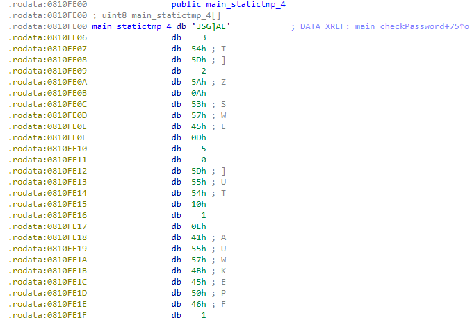

# gogo

## 題目描述 (Description)

Hmmm this is a weird file....

### 提示 (Hints)

1. Hint 1
   use go tool objdump or ghidra

## 解題思路 (Solution Walkthrough)

1.  **第一步**：直接用 ida pro 分析這個檔案，觀察到有兩個重要的函式，分別為 `main_checkPassword` 和 `main_ambush`
   ```c
   // main.checkPassword
   bool __gostk main_checkPassword(string input)
   {
      __int32 v1; // eax
      int v2; // ebx
      uint8 key[32]; // [esp+4h] [ebp-40h] BYREF
      _BYTE v4[32]; // [esp+24h] [ebp-20h]

      if ( input.len < 32 )
         os_Exit(0);
      ((void (*)(void))loc_8090B18)();
      qmemcpy(key, "861836f13e3d627dfa375bdb8389214e", sizeof(key));
      ((void (*)(void))loc_8090FE0)();
      v1 = 0;
      v2 = 0;
      while ( v1 < 32 )
      {
         if ( (unsigned int)v1 >= input.len || (unsigned int)v1 >= 0x20 )
            runtime_panicindex();
         if ( (key[v1] ^ input.str[v1]) == v4[v1] )
            ++v2;
         ++v1;
      }
      return v2 == 32;
   }
   ```
   ```c
   // main.ambush
   void __gostk main_ambush(string a)
   {
      int j; // eax
      _slice_uint8 buf; // [esp+0h] [ebp-94h]
      _slice_uint8 s; // [esp+4h] [ebp-90h]
      _slice_uint8 dataa; // [esp+Ch] [ebp-88h]
      string data; // [esp+Ch] [ebp-88h]
      string data_4; // [esp+10h] [ebp-84h]
      uint8 v7; // [esp+1Fh] [ebp-75h]
      unsigned int i; // [esp+20h] [ebp-74h]
      uint8 hashed[16]; // [esp+24h] [ebp-70h] BYREF
      uint8 key[32]; // [esp+34h] [ebp-60h] BYREF
      uint8 v11[32]; // [esp+54h] [ebp-40h] BYREF
      uint8 v12[32]; // [esp+74h] [ebp-20h] BYREF

      dataa = runtime_stringtoslicebyte((uint8 (*)[32])v11, a);
      crypto_md5_Sum(dataa);
      ((void (*)(void))loc_8091008)();
      ((void (*)(void))loc_8090B18)();
      qmemcpy(key, "861836f13e3d627dfa375bdb8389214e", sizeof(key));
      for ( j = 0; j < 16; j = i + 1 )
      {
         i = j;
         buf.array = hashed;
         *(_QWORD *)&buf.len = 0x1000000010LL;
         data = encoding_hex_EncodeToString(buf);
         if ( i >= data.len
            || (v7 = data.str[i],
               s.array = key,
               *(_QWORD *)&s.len = 0x2000000020LL,
               data_4 = runtime_slicebytetostring((uint8 (*)[32])v12, s),
               i >= data_4.len) )
         {
            runtime_panicindex();
         }
         if ( v7 != data_4.str[i] )
            os_Exit(0);
      }
   }
   ```

2.  **第二步**：其中 `main_checkPassword` 是把使用者的輸入去和 key 逐個 byte 進行 xor，並檢查是否等於 `v4`，`v4` 則是在 `.rodata` 裡面 (如圖)，於是我寫了一個腳本 (請參考 solution.js) 來得到 password (`reverseengineericanbarelyforward`)
   

3.  **第三步**：而 `main_ambush` 是把輸入做 MD5 並轉為 hex 編碼，然後逐字元比對前 16 個字元是否等於 key 的前 16 個字元
   使用 john 暴力破解後發現 `goldfish` 做 MD5 的結果剛好等於 key (`861836f13e3d627dfa375bdb8389214e`)
   ```
   ┌──(kali㉿kali)-[~/Desktop]
   └─$ john --format=raw-md5 --wordlist=/usr/share/wordlists/rockyou.txt hash.txt
   Using default input encoding: UTF-8
   Loaded 1 password hash (Raw-MD5 [MD5 256/256 AVX2 8x3])
   Warning: no OpenMP support for this hash type, consider --fork=4
   Press 'q' or Ctrl-C to abort, almost any other key for status
   goldfish         (?)     
   1g 0:00:00:00 DONE (2026-02-07 09:39) 100.0g/s 153600p/s 153600c/s 153600C/s 753951..mexico1
   Use the "--show --format=Raw-MD5" options to display all of the cracked passwords reliably
   Session completed. 
   ```

4.  **第四步**：因題目有提示這個程式跑在一個伺服器裡面，故使用 nc 連進去即可取得 flag
   ```
   ┌──(kali㉿kali)-[~/Desktop]
   └─$ nc wily-courier.picoctf.net 57998
   Enter Password: reverseengineericanbarelyforward
   =========================================
   This challenge is interrupted by psociety
   What is the unhashed key?
   goldfish
   Flag is:  picoCTF{p1kap1ka_p1c01a475a0d}
   ```

## Flag

```text
picoCTF{p1kap1ka_p1c01a475a0d}
```