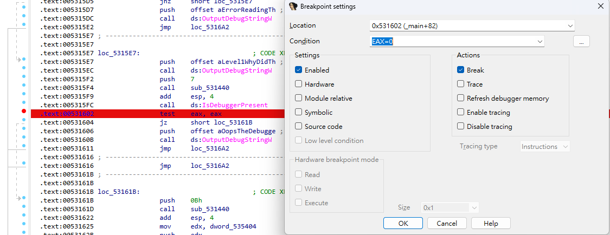

# WinAntiDbg0x100

## 題目描述 (Description)

This challenge will introduce you to 'Anti-Debugging.' Malware developers don't like it when you attempt to debug their executable files because debugging these files reveals many of their secrets! That's why, they include a lot of code logic specifically designed to interfere with your debugging process.
Now that you've understood the context, go ahead and debug this Windows executable!
This challenge binary file is a Windows console application and you can start with running it using `cmd` on Windows.
Challenge can be downloaded [here](https://artifacts.picoctf.net/c_titan/54/WinAntiDbg0x100.zip). Unzip the archive with the password `picoctf`

### 提示 (Hints)

1. Hint 1  
    Hints will be displayed to the Debug console. Good luck!

## 解題思路 (Solution Walkthrough)

1. **第一步**：下載下來以後用 ida 跑跑看，結果程式說偵測到 debugger 了

    ```text
    ### Level 1: Why did the clever programmer become a gardener? Because they discovered their talent for growing a 'patch' of roses!

    ### Oops! The debugger was detected. Try to bypass this check to get the flag!
    ```

2. **第二步**：先看一下程式的邏輯
    1. 可以看到他會偵測是否存在 debugger

        ```c
        if ( IsDebuggerPresent() )
        {
            OutputDebugStringW(L"### Oops! The debugger was detected. Try to bypass this check to get the flag!\n");
        } else {
            ...
        }
        ```

    2. 上面這段程式碼以組合語言的形式長這樣，如果偵測到有 debugger，那麼 eax 就會被設為 1，導致程式導致程式不執行 jz (jump if zero) 跳轉 `loc_5316A2`

        ```text
        call    ds:IsDebuggerPresent
        .text:00531602                 test    eax, eax
        .text:00531604                 jz      short loc_53161B
        .text:00531606                 push    offset aOopsTheDebugge ; "### Oops! The debugger was detected. Tr"...
        .text:0053160B                 call    ds:OutputDebugStringW
        .text:00531611                 jmp     loc_5316A2
        ```

3. **第三步**：所以我們可以設定一個 breakpoint 在 `.text:00531602 test eax, eax`，並把 eax 設為 0
    

4. **第四步**：設定完成以後重跑 debugger，即可得到 flag

    ```text
         _            _____ _______ ______  
        (_)          / ____|__   __|  ____| 
    _ __  _  ___ ___ | |       | |  | |__    
    | '_ \| |/ __/ _ \| |       | |  |  __|   
    | |_) | | (_| (_) | |____   | |  | |      
    | .__/|_|\___\___/ \_____|  |_|  |_|      
    | |                                       
    |_|                                       
    Welcome to the Anti-Debug challenge!
    ### Level 1: Why did the clever programmer become a gardener? Because they discovered their talent for growing a 'patch' of roses!
    WOW64 process has been detected (pid=0)
    PDBSRC: loading symbols for 'C:\Users\Jimmy\Desktop\picoCTF-solution\reverse engineering\medium\WinAntiDbg0x100\WinAntiDbg0x100\WinAntiDbg0x100.exe'...
    PDB: using PDBIDA provider
    Could not find PDB file ''.
    Please check _NT_SYMBOL_PATH
    PDB: Failed to get PDB file details from 'C:\Users\Jimmy\Desktop\picoCTF-solution\reverse engineering\medium\WinAntiDbg0x100\WinAntiDbg0x100\WinAntiDbg0x100.exe'
    Expected data back.
    ### Good job! Here's your flag:
    ### ~~~ picoCTF{d3bug_f0r_th3_Win_0x100_17712291}
    ### (Note: The flag could become corrupted if the process state is tampered with in any way.)
    ```

## Flag

```text
picoCTF{d3bug_f0r_th3_Win_0x100_17712291}
```
