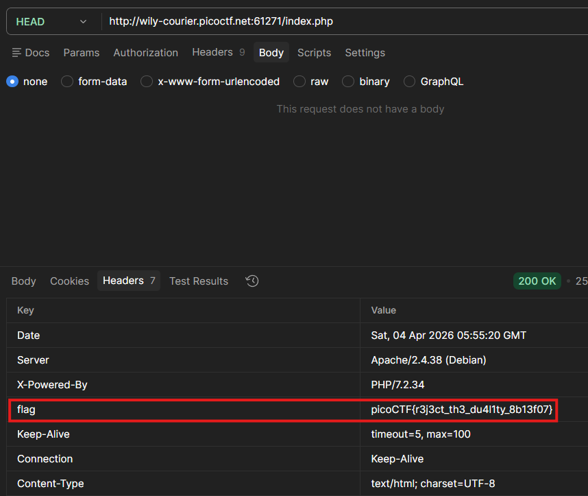

# GET aHEAD

## 題目描述 (Description)

Find the flag being held on this server to get ahead of the competition

### 提示 (Hints)

1. Hint 1  
    Maybe you have more than 2 choices
2. Hint 2  
    Check out tools like Burpsuite to modify your requests and look at the responses

## 解題思路 (Solution Walkthrough)

1. **第一步**：進去網站，看到如果是 `GET`，會返回紅色，如果是 `POST` 則返回藍色

2. **第二步**：因為題目叫做 aHEAD，於是用 `HEAD` 來試試看，並取得 flag
    

## Flag

```text
picoCTF{r3j3ct_th3_du4l1ty_8b13f07}
```
