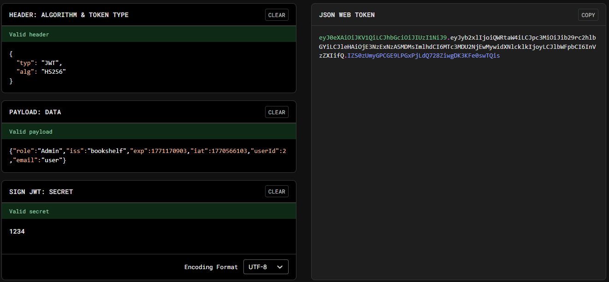

# Java Code Analysis!?!

## 題目描述 (Description)

BookShelf Pico, my premium online book-reading service.
I believe that my website is super secure. I challenge you to prove me wrong by reading the 'Flag' book!

### 提示 (Hints)

1. Hint 1
   Maybe try to find the JWT Signing Key ("secret key") in the source code? Maybe it's hardcoded somewhere? Or maybe try to crack it?
2. Hint 2
   The 'role' and 'userId' fields in the JWT can be of interest to you!
3. Hint 3
   The 'controllers', 'services' and 'security' java packages in the given source code might need your attention. We've provided a README.md file that contains some documentation.
4. Hint 4
   Upgrade your 'role' with the new (cracked) JWT. And re-login for the new role to get reflected in browser's localStorage.

## 解題思路 (Solution Walkthrough)

1.  **第一步**：先使用預設的帳號密碼登入，發現主頁中有一本書叫做 flag，且他是被鎖住而無法查看

2.  **第二步**：打開瀏覽器的檢查工具，跳到應用程式，發現本機儲存空間裡面有兩個東西，一個是 `auth-token` 一個是 `token-payload`，其中 `auth-token` 是一個 JSON Web Token，而 `token-payload` 則是他的資料

3.  **第三步**：由於 JWT 應該會受 secret 保護，所以查看了 Java 程式碼發現他的 secret 固定為 1234
   ```Java
   // bookshelf-pico\src\main\java\io\github\nandandesai\pico\security\SecretGenerator.java
   private String generateRandomString(int len) {
      // not so random
      return "1234";
   }
   ```

4.  **第四步**：於是使用 https://www.jwt.io 並依照格式產生一個更改後的 JWT，把 `auth-token` 和 `token-payload` 改成修改過後的內容重新填入，即可取得 flag
   

## Flag

```text
picoCTF{w34k_jwt_n0t_g00d_602ce414}
```