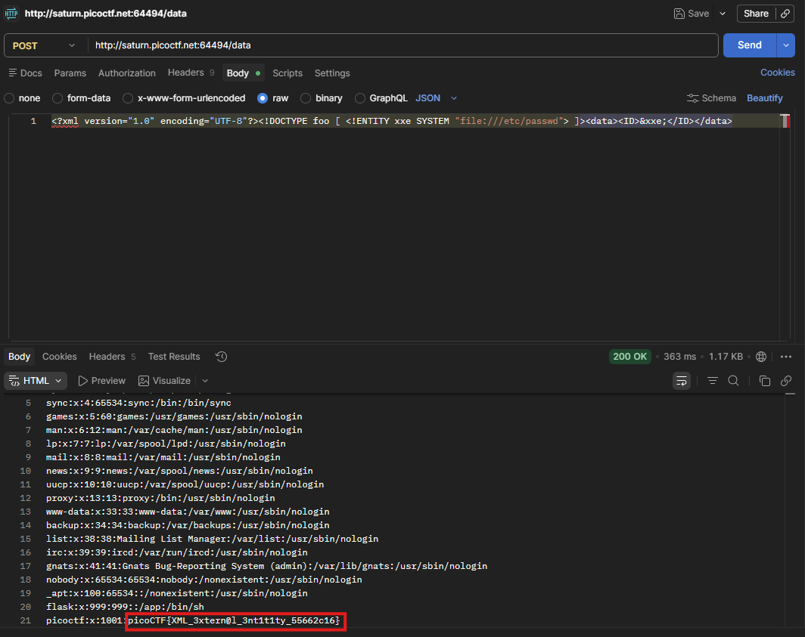

# SOAP

## 題目描述 (Description)

The web project was rushed and no security assessment was done. Can you read the /etc/passwd file?

### 提示 (Hints)

1. Hint 1
   XML external entity Injection

## 解題思路 (Solution Walkthrough)

1.  **第一步**：先進去網站，點擊 Details，發現他傳送資料的方式都是使用 xml，而且提示是說這題是 `XXE (XML eXternal Entity)`

2.  **第二步**：於是參考[這個網站](https://portswigger.net/web-security/xxe)上的範例即可取得 flag (如圖)
   

## Flag

```text
picoCTF{XML_3xtern@l_3nt1t1ty_55662c16}
```