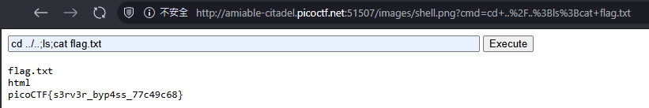

# byp4ss3d

## 題目描述 (Description)

A university's online registration portal asks students to upload their ID cards for verification. The developer put some filters in place to ensure only image files are uploaded but are they enough? Take a look at how the upload is implemented. Maybe there's a way to slip past the checks and interact with the server in ways you shouldn't.
Additional details will be available after launching your challenge instance.

### 提示 (Hints)

1. Hint 1
   Apache can be tricked into executing non-PHP files as PHP with a .htaccess file.
2. Hint 2
   Try uploading more than just one file.

## 解題思路 (Solution Walkthrough)

1.  **第一步**：打開網站後發現一個上傳頁面，其中只能上傳 `JPG, PNG, GIF` 而已

2.  **第二步**：到處亂逛以後發現這個是 `Apache/2.4.62 (Debian) Server at amiable-citadel.picoctf.net Port 51507`，於是嘗試上傳一個 .htaccess 檔案，使得伺服器可以讓 png 格式當作 php 在跑

3.  **第三步**：在網路上找到有人寫好的 [webshell](https://gist.github.com/joswr1ght/22f40787de19d80d110b37fb79ac3985)，下載以後把副檔名改為 `.png` 後上傳
   
4.  **第四步**：嘗試使用指令尋找 `flag.txt`，最後使用 `cd ../..;ls;cat flag.txt` 成功取得 flag (如附圖)

   

## Flag

```text
picoCTF{s3rv3r_byp4ss_77c49c68}
```